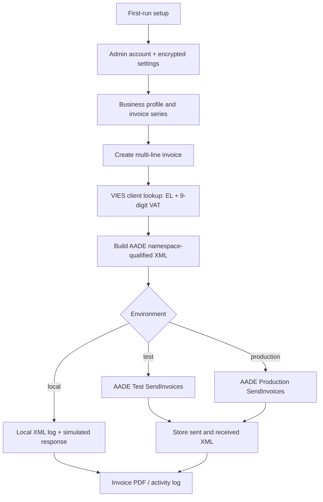

# myAade

Local-first, bilingual Greek invoicing with AADE myDATA submission, VIES client validation, PDF invoices, and Cloudflare-protected administration.

## Environments

| Mode | Purpose | AADE submission |
|---|---|---|
| `local` | Safe local simulation and draft work | Never calls AADE |
| `test` | AADE Test environment | Real submission to `mydataapidev.aade.gr` |
| `production` | Live business use | Real submission to `mydatapi.aade.gr` |

Deletion is allowed only in `local`. In Test and Production, submitted records must be cancelled through AADE rather than removed.

## How it works



## Features

- Greek / English UI and light / dark mode
- Local SQLite database, encrypted integration secrets
- Admin login, users, Cloudflare Turnstile server-side validation
- AADE invoice types, multiple invoice lines, zero-VAT exemption validation
- VIES validation for Greek VATs (`EL` service code)
- Configurable invoice series and number
- AADE XML sent/received debug log and inline PDF invoices

## Run

```bash
python3 -m venv .venv
.venv/bin/pip install -r requirements.txt
python app.py
```

Open `http://127.0.0.1:5000` and complete first-run setup. Keep `.env`, `instance/`, and Cloudflare credentials out of Git.

## Deploy with Cloudflare Tunnel

Configure `cloudflared/config.yml` outside Git, then install the included services:

```bash
sudo cp deploy/systemd/myaade.service /etc/systemd/system/
sudo cp deploy/systemd/myaade-cloudflared.service /etc/systemd/system/
sudo systemctl daemon-reload
sudo systemctl enable --now myaade.service myaade-cloudflared.service
```

Use `journalctl -u myaade.service -f` for application logs.

## Security

Secrets entered through Settings are encrypted before SQLite storage. Back up `instance/myaade-master.key` together with the database; losing the key makes stored secrets unrecoverable.

## License

[MIT](LICENSE)
