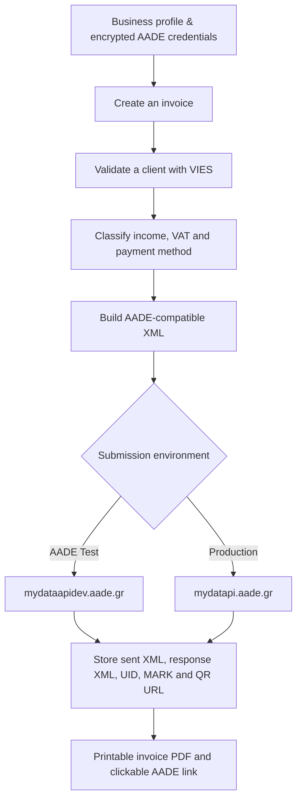
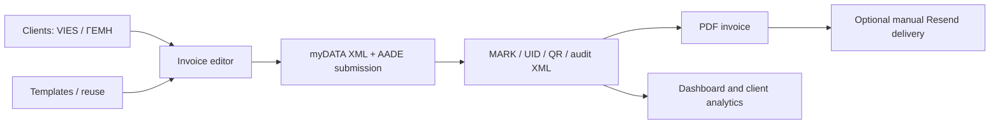

# Elefthero

## Recent product capabilities

- AADE Test and Production credential pairs, encrypted at rest and selected by environment.
- Multi-line invoices with decimal quantity × unit price, VAT exemptions, income classifications, PDF notes, XML inspection and AADE MARK/UID/QR handling.
- Saved clients with VIES and ΓΕΜΗ enrichment, filtering, pagination and per-client invoice analytics.
- Reusable invoice templates plus an editable “reuse as new draft” workflow.
- Resend-based, manually initiated delivery of AADE-transmitted invoice PDFs; the API key is stored only in encrypted application settings, never in this repository.
- Dashboard reporting for transmitted turnover, VAT and top customers.

## The open-source way to invoice in Greece.

Elefthero (Ελεύθερο) is a self-hosted, bilingual invoicing workspace for Greek small businesses. It makes AADE myDATA reporting understandable, inspectable, and accessible—without locking a business into an expensive proprietary accounting platform.

## Why Elefthero

Greek invoicing software is often costly, opaque, and built around long contracts. Elefthero is an open-source alternative: the business controls its data, can inspect every XML submission, and can run the application on its own server.

- **Freedom** — MIT-licensed, self-hosted, no vendor lock-in.
- **Openness** — sent and received AADE XML is retained and viewable in the developer log.
- **Accessibility** — Greek / English interface, clear setup, simple invoice flow, and a light high-contrast design.

## How it works



## Features

- AADE Test and Production submission modes—both perform real API submissions
- AADE invoice XML with income classifications, payment methods, VAT exemptions and EUR currency
- VIES client verification for Greek VAT numbers (`EL` service code)
- Reusable SQLite client book, including addresses copied into invoices
- Multiple invoice lines, configurable invoice series and numbering
- Encrypted-at-rest AADE and Cloudflare secrets
- User management and Cloudflare Turnstile login protection
- Developer log with sent and received XML
- PDF invoice with business identity, payment method, UID, ΜΑΡΚ and AADE QR URL
- Invoice templates and editable draft reuse for recurring work
- Dashboard totals, transmitted VAT and top-customer reporting
- Manual delivery of transmitted invoice PDFs through securely configured Resend

## Product map



## Important disclaimer

Elefthero is open-source software provided on an “as is” basis. It is not accounting, tax, legal, or professional advice, and it does not replace review by a qualified accountant. AADE may change its myDATA APIs, schemas, validation rules, operational requirements, or services at any time; such changes can affect integrations, submissions, and results. You are solely responsible for validating configuration, invoices, submissions, records, and compliance before using the software in Test or Production. The project maintainer/developer accepts no obligation or liability for business, accounting, tax, technical, submission, data, or compliance outcomes arising from use of the software. Always consult your accountant or another appropriately qualified professional for your specific circumstances.

## Run locally

```bash
python3 -m venv .venv
.venv/bin/pip install -r requirements.txt
python app.py
```

Open `http://127.0.0.1:5000` and complete the secure first-run setup. Never commit `.env`, `instance/`, or Cloudflare credentials.

## Deployment

The included systemd units run Gunicorn and Cloudflare Tunnel after reboot:

```bash
sudo cp deploy/systemd/myaade.service /etc/systemd/system/
sudo cp deploy/systemd/myaade-cloudflared.service /etc/systemd/system/
sudo systemctl daemon-reload
sudo systemctl enable --now myaade.service myaade-cloudflared.service
```

Use `journalctl -u myaade.service -f` for application logs.

## Devpost / Codex Hackathon

Elefthero was built as an Apps for your life project for the OpenAI Codex Hackathon.

### How we collaborated with Codex and GPT-5.6

Codex was the hands-on implementation partner throughout the project. We used it to turn real AADE validation responses into concrete XML fixes, build the Flask/SQLite product end-to-end, and iteratively refine the live deployment.

- Built the Flask data model, first-run setup, encrypted settings, user administration, and audit logging.
- Implemented and debugged AADE invoice XML against the official documentation and real AADE Test responses: invoice ordering, counterpart branches, classification namespaces, payment-method nesting, and mandatory currency.
- Added VIES client lookup, reusable client addresses, multi-line invoices, zero-VAT validation, PDF rendering, QR/UID/MARK response handling, and Cloudflare Tunnel deployment.
- Used Codex to make product decisions visible in code: local secrets never enter Git, sent/received XML is inspectable, and AADE Test and Production are explicit real-submission modes.
- Iterated on the interaction design using live feedback: simplified light interface, Greek/English controls, understandable AADE error surfacing, and printable invoices with business identity.

The result is not a mockup: it is a running, self-hosted application with real AADE Test API submission and a public, MIT-licensed codebase.

### Demo checklist

1. Complete Business Profile and AADE Test credentials in Settings.
2. Validate a Greek client through VIES.
3. Create a service invoice, choose payment method and income classification, then submit to AADE Test.
4. Open Developer Logs to show the exact sent XML and AADE response XML.
5. Open the generated PDF and AADE QR URL.

## License

[MIT](LICENSE)
