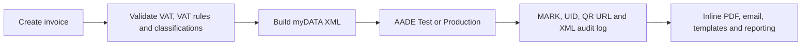

# Elefthero

## The open-source way to invoice in Greece

Elefthero (Ελεύθερο) is a self-hosted, bilingual invoicing workspace for Greek sole traders and small businesses. It makes AADE myDATA reporting understandable, inspectable, and accessible—without locking a business into an expensive proprietary platform.

The myDATA integration is built against the official [AADE myDATA REST API documentation v2.0.2 (June 2026)](https://www.aade.gr/sites/default/files/2026-06/myDATA%20API%20Documentation%20v2.0.2_preofficial_erp.pdf).

## Why Elefthero

In Greece, businesses are required to transmit invoice data to AADE myDATA. Yet for many small businesses, the available choices can feel discouraging: expensive SaaS subscriptions, opaque systems, long contracts, or a public tool that is necessary but not designed around a simple everyday workflow.

Elefthero—Greek for “free”—comes from a simple belief: complying with a public obligation should not mean giving up control over your own business data. A shop owner, freelancer, or small local business should be able to understand what is being sent, inspect the XML, keep the records locally, and adapt the tool to how they actually work.

- **Freedom** — MIT-licensed, self-hosted, no vendor lock-in.
- **Openness** — sent and received AADE XML is retained and viewable in the developer log.
- **Accessibility** — Greek / English interface, clear setup, simple invoice flow, and a light high-contrast design.

## Supported documents

| Type | Workflow |
| --- | --- |
| `1.1` | Τιμολόγιο Πώλησης |
| `2.1` | Τιμολόγιο Παροχής Υπηρεσιών |
| `5.1` | Πιστωτικό Τιμολόγιο / Συσχετιζόμενο |
| `11.1` | ΑΛΠ — Απόδειξη Λιανικής Πώλησης |
| `11.2` | ΑΠΥ — Απόδειξη Παροχής Υπηρεσιών |
| `11.4` | Πιστωτικό Στοιχείο Λιανικής |

## Features

Elefthero is intentionally focused, but complete enough for day-to-day small-business invoicing:

- AADE Test and Production submissions, real myDATA XML, MARK/UID/QR results, and invoice cancellation.
- Multi-line invoices, VAT and VAT-exemption handling, payment methods, income/E3 classifications, series, numbering, notes, and credit-invoice reuse.
- Inline PDF invoices with business logo/details, customer information, line VAT, AADE identifiers, and manual Resend delivery after transmission.
- Saved clients with VIES validation, optional ΓΕΜΗ enrichment, reusable addresses, filters, pagination, and invoice-by-type statistics.
- Templates, editable “reuse as new draft”, dashboard totals, top customers, and client analytics.
- Secure setup, encrypted settings, user roles, optional Cloudflare Turnstile, optional authenticator-app 2FA, audit logs, and accessibility controls.

Read the complete [feature reference](docs/FEATURES.md).

## How it works

Read the [service architecture](docs/ARCHITECTURE.md) for the deployed services, authentication, AADE submission, and client-enrichment flows.

## Technical stack

Elefthero is Python/Flask with SQLite, Gunicorn, systemd, Cloudflare Tunnel, AADE REST/XML, ReportLab PDFs, Fernet encryption, optional TOTP 2FA, VIES/ΓΕΜΗ enrichment, and Resend email delivery. There is no Node.js build step.

Read the detailed [technical stack reference](docs/TECHNICAL_STACK.md).

## Installation

Clone the repository, create a virtual environment, install `requirements.txt`, configure a strong `.env` `SECRET_KEY`, and complete first-run setup in the browser. AADE, Resend, Turnstile, and 2FA secrets are configured in the authenticated UI and encrypted locally; they do not belong in Git.

Read the complete [installation, configuration, deployment, backup, and update guide](docs/INSTALLATION.md). Start with [`.env.example`](.env.example).

## Important disclaimer

Elefthero is open-source software provided on an “as is” basis. It is not accounting, tax, legal, or professional advice, and it does not replace review by a qualified accountant. AADE may change its myDATA APIs, schemas, validation rules, operational requirements, or services at any time; such changes can affect integrations, submissions, and results. You are solely responsible for validating configuration, invoices, submissions, records, and compliance before using the software in Test or Production. The project maintainer/developer accepts no obligation or liability for business, accounting, tax, technical, submission, data, or compliance outcomes arising from use of the software. Always consult your accountant or another appropriately qualified professional for your specific circumstances.

## Devpost / Codex Hackathon

Elefthero was built as an Apps for your life project for the OpenAI Codex Hackathon.

### Inspiration

Greek small businesses must comply with AADE myDATA, yet many invoicing platforms are expensive, opaque, or difficult to adapt to daily work. Elefthero—Greek for “free”—was inspired by the idea that a business should be able to understand, inspect, and control its own invoicing data without vendor lock-in.

This is personal in a practical way: compliance software should reduce anxiety, not create another dependency. The goal was to make the “what did I send, why did AADE reject it, and where is my record?” path visible to the person running the business—not hidden behind a subscription wall or an unexplained support ticket.

### How we collaborated with Codex and GPT-5.6

Codex was the hands-on implementation partner throughout the project. We used it to turn real AADE validation responses into concrete XML fixes, build the Flask/SQLite product end-to-end, and iteratively refine the live deployment.

- Built the Flask data model, first-run setup, encrypted settings, user administration, TOTP 2FA, accessibility controls, and audit logging.
- Implemented and debugged AADE invoice XML against the official documentation and real AADE Test responses: element ordering, retail counterpart restrictions, credit-invoice rules, classification namespaces, payment-method nesting, and mandatory currency.
- Added VIES client lookup, ΓΕΜΗ enrichment, reusable client data, multi-line invoices, zero-VAT validation, PDF rendering, QR/UID/MARK response handling, and Cloudflare Tunnel deployment.
- Used Codex to make product decisions visible in code: local secrets never enter Git, sent/received XML is inspectable, and AADE Test and Production are explicit real-submission modes.
- Iterated on the interaction design using live feedback: simplified invoice types, retail defaults, client analytics, templates, light UI, Greek/English controls, and understandable AADE error surfacing.

The result is not a mockup: it is a running, self-hosted application with real AADE Test API submission and a public, MIT-licensed codebase.

### Demo checklist

1. Complete Business Profile and AADE Test credentials in Settings.
2. Validate a Greek client through VIES or use a retail workflow.
3. Create an invoice with payment method, VAT, and income classification, then submit to AADE Test.
4. Open Developer Logs to show the exact sent XML and AADE response XML.
5. Open the generated PDF and AADE QR URL.
6. Optionally show templates, client-by-type analytics, accessibility controls, and 2FA enrollment.

## License

[MIT](LICENSE)
