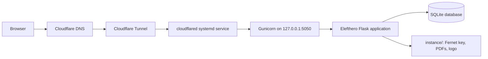
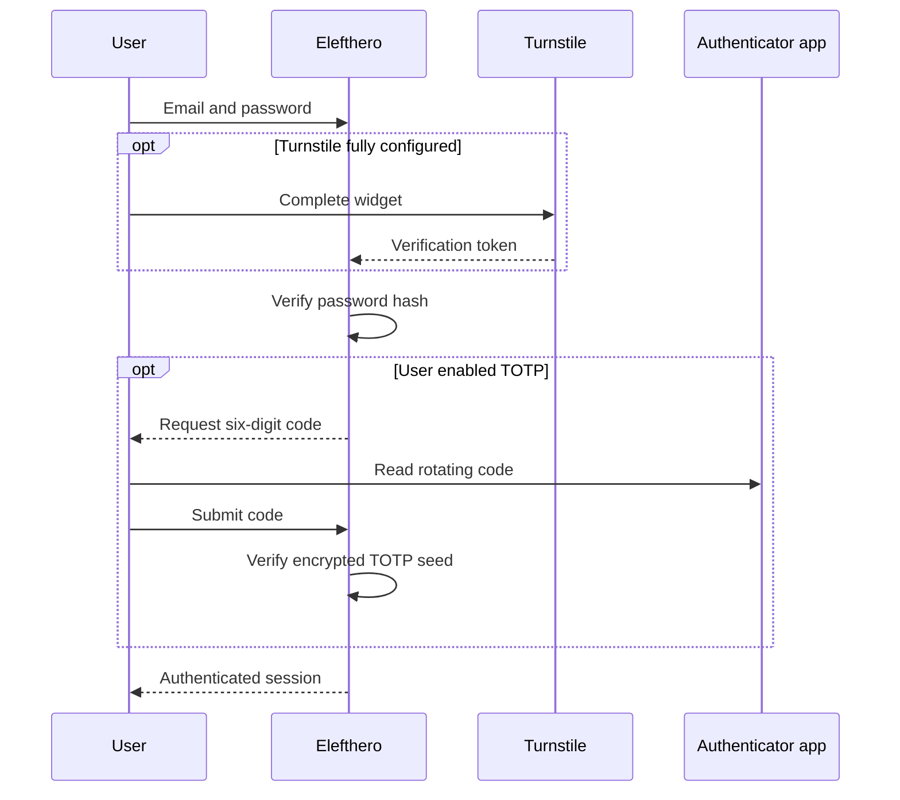
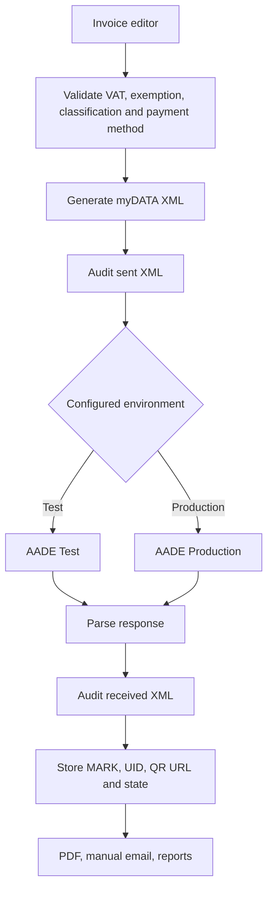
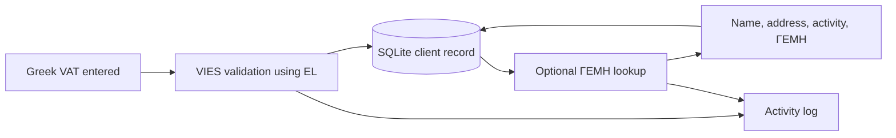

# Service architecture

## Public access and application service

The included `myaade.service` starts Gunicorn and restarts it after boot or failure. `myaade-cloudflared.service` runs the Cloudflare Tunnel process. Adjust their example paths before using them in another deployment.

## Authentication service

## AADE submission service

## Client enrichment service

